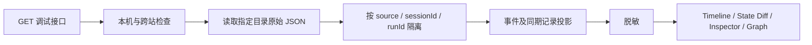

# Chorify Agent Debug Console · 实现与验收

## 当前精简界面（2026-09-15，替代下方旧版布局）

顶部并列显示本轮用户需求和最终结果。会话轮次选择器可以切换此前或之后的请求。详情仅保留三个页签：

1. **子意图流程**：理解结果、共同入口、逐子意图交付目标、依赖与规划、对应模型和工具步骤、状态变化与结果。调用归属仅通过保存的 node/item 标识或模型输入中的 item.id 绑定，无法确定归属的调用保留为共享步骤。
2. **历史上下文**：此前逐轮原话和 final 回答；每一次模型请求实际包含的历史正文、索引、近期请求与任务/素材；按消息顺序展开完整拼接输入。修复重试中的 original.conversation 同样可见。当前任务或后续消息不会被当作此前原始上下文。
3. **全局 State**：按轮次读取已记录的 before/after 业务快照。没有完整快照的旧轮次只显示当时任务快照，明确为局部记录，不用最终账本反推历史。

本阶段只改 Debug 只读聚合和 UI，未改变运行时的意图识别或执行。新增 10 个离线测试，与既有 Debug 测试合计 56 项通过。真实历史回归：第三轮“你上一轮的回答是什么”的三次实际模型输入均包含前两轮完整问答；UI 展示 4 条历史正文及其拼接位置，保存的素材引用拒绝仍原样保留。

旧版多个 Inspector、原始时间线、异常汇总和成果图入口不再出现在当前 UI。底层完整 Debug JSON API 仍保留。

## 随后完成的 P0 合同修复（2026-09-15）

UI 验证完成后，单独修改了展示引用合同：消息与产物分别绑定，入口与执行均通过同一只读解析器校验会话、对象类型、版本和正文指纹；展示消息不创建任务或产物。新轮次记录独立的 stateBefore/stateAfter 业务账本，供全局 State 页面读取；不回填旧记录、不向模型上下文增加快照。

新增 13 项 P0 离线测试全部通过，其中一项通过真实本地 HTTP 后台和 DeepSeek 协议适配器运行，模型响应由本地网关提供。没有新增付费调用。真实失败草稿回放：从连续 3 次引用拒绝变为 1 次入口接受并逐字返回历史回答。

运行限制：3214 Debug UI 已生效；本轮自动审批拒绝重启 3212 后台（仅返回 blocked by policy），所以该进程尚未加载 P0 新代码。重启后台并保持原 MVP_DATA_DIR 后，新轮次才会使用合同修复和全局 State 快照。旧失败 Trace 保持不变。

2026-09-15。控制台现支持只读归档和可选的实时指令入口。实时入口复用现有创作后台，不改 taskStore Schema、推理、编译、工具执行或业务验收。下文的历史验收数据保留原批次范围。

## 人类可读的执行过程（新增）

默认详情页展示“系统如何理解这句话 → 这次走了什么路径 → 规划和子目标进度 → 按实际发生顺序查看 → 确认与返回”。列表使用用户请求和时间，UUID、来源指纹和原始 JSON 移入可展开的技术详情。

- **完整提示词与上下文**：优先按供应商实际请求的 messages/input 顺序展示系统指令、用户输入、历史消息、工具返回；只有传输前输入时明确标注。提示词正文不裁剪，滚动阅读。模型可用工具、实际函数选择、完整输出和校验结果分别展示。
- **工具输入与返回**：提供给工具的实际参数、工具结果及已记录的结构/权限/来源/预算检查。模型函数选择仅按调用标识匹配，不把编译器绑定的工具冒充模型选择；未知的动作提出者直接标明未记录。
- **子目标进度 / 状态变化**：从同一任务在本轮的快照读取状态与覆盖变化；显示每项要求的 expected/actual/status。不以产物个数或本轮 completed 推断全部义务完成。执行图取按时间最新的记录，早期 prepared 事件不会覆盖后续完成快照。
- **确认与续跑**：显式目标+保存决策用于识别按钮/API 续跑入口，文字确认需要实际接受的操作。展示此前批准对象、版本、本轮批准状态及理解调用数。另有明确标为“当前代码机制说明”的检查顺序，不冒充已执行证据。
- 原始合同、原始快照、原始时间线和完整 JSON 导出继续可用。可读层为只读投影，不新增推理模型或生产业务规则。

记录限制：HTTP 层在创建 Run 前拒绝的过期/冲突确认没有本轮 Trace；旧记录缺少逐项检查者或状态写入者时不能补造。没有模型函数选择记录不代表程序没有调度工具。最终账本不用于伪造本轮的历史快照。

新增 `dist/debug/readable.mjs`（纯证据投影与名称映射）、`dist/debug/readable-view.js`（可读组件）和 `tests/debug-readable.test.mjs`（13 项离线测试）；更新 Debug 静态资源路由、app/live/index/style。此次没有修改 Agent、意图识别、工具执行和业务校验逻辑。

验证：`node --test tests/debug-console.test.mjs tests/debug-live.test.mjs tests/debug-readable.test.mjs`，共 46 项。浏览器核对真实历史“你是什么模型”和“猫的图片”，没有重放模型或媒体调用；实时刷新另用明确标记的离线后台替身验证。证据目录：`C:/Users/asus/Desktop/codex-workspace/chorify-debug-readable-20260915`。

## 实时发送指令（新增）

打开 <http://127.0.0.1:3214/>，顶部选择“新建会话”或已有实时会话，输入 Query，点击“发送并跟随”或按 Enter（Shift+Enter 换行）。页面自动进入这次 Run；事件流即时更新，持久 Trace 每 2 秒刷新。切换 Timeline、Context、Plan / Skill、Tool、State Diff、Coverage / 验收、交付 / 错误查看各阶段记录，Trace 自动更新不会清空尚未发送的输入或主动重置检查面板。浏览器整页刷新不保存未发送草稿。

本轮完成后可在相同会话继续，也可选择新建会话。“停止本轮”调用现有后台取消接口，最终结果以后台落盘事件为准；它不承诺撤销供应商已受理的媒体工作。浏览器刷新会根据待观察 Run 或 URL 恢复读取，绝不自动重新提交。关闭页面不会自动取消后台任务。

当前实时后台使用独立的 `data/debug-live-console-20260915`，在现有两个归档来源后追加为 source2；旧归档保持只读，不能直接作为实时续聊会话。查看旧 Run 时仍可通过顶部新建实时会话发送 Query。

在两个终端中分别启动（端口已运行时不要重复启动）：

```powershell
# 终端 1：创作后台，只有这个进程加载供应商配置
$debugNode = 'C:/Users/asus/.cache/codex-runtimes/codex-primary-runtime/dependencies/node/bin/node.exe'
$env:PORT = '3212'
$env:MVP_DATA_DIR = 'data/debug-live-console-20260915'
& $debugNode --env-file-if-exists=.env server/index.mjs
```

```powershell
# 终端 2：控制台，两个目录必须对应同一个实际数据目录
$debugNode = 'C:/Users/asus/.cache/codex-runtimes/codex-primary-runtime/dependencies/node/bin/node.exe'
& $debugNode server/debug-server.mjs --port 3214 --data data/manual-fixed-server --data C:/Users/asus/Desktop/codex-workspace/chorify-real-validation-20260914/sessions --boundaries C:/Users/asus/Desktop/codex-workspace/chorify-real-validation-20260914/boundaries --backend http://127.0.0.1:3212 --live-data data/debug-live-console-20260915
```

不传 `--backend` 和 `--live-data` 时保持只读。实时模式两者必须同时提供，后台 `/api/config` 的数据目录指纹必须匹配。固定本机地址、Origin/Host 检查与独立 Debug CSRF 共同保护发送入口；后台令牌不交给浏览器。

| 实时 API | 用途 |
|---|---|
| GET /api/debug/live/config | 连接状态、模型、实时 source 与 Debug CSRF |
| GET /api/debug/live/sessions | 当前实时后台会话列表 |
| POST /api/debug/live/chat | 仅接受 message、requestId 和可选 sessionId；转发一次已有 /api/chat |
| POST /api/debug/live/cancel | 仅接受 sessionId；转发已有 /api/cancel |

调用链：`Debug 输入框 → 本机/CSRF/字段/目录检查 → 现有 /api/chat → 原 Agent → 原会话落盘 → Debug 聚合 → 面板刷新`。事件流断开后继续读取原 Run，不自动重试 POST。提交结果未知且没有落盘记录时保持观察，需先核对后台再决定后续操作；本功能不提供自动故障重放。

实时展示受已有 Trace 记录时机限制：模型等待中可见已落盘的调用与输入；供应商 actualRequest、输出或其他尚未落盘的信息可能要等调用返回后才出现。此功能不会编造中间思考，也没有新增模型推理调用。

本次变更：新增 `server/debug-live.mjs`、`dist/debug/live.js`、`tests/debug-live.test.mjs`、`tests/fixtures/debug-live-backend.mjs`；更新 debug-server、debug UI 和本文。`server/index.mjs` 仅增加数据目录指纹用于匹配，不修改业务执行逻辑。

验证命令：`node --test tests/debug-console.test.mjs tests/debug-live.test.mjs`。24 个原有测试加 9 个新增测试，共 33 项通过。浏览器在明确标记 OFFLINE_TEST_DOUBLE 的隔离后台验证了回车发送、返回前查看输入、同会话续聊、刷新后继续观察并自动完成、停止后 cancelled。测试替身不执行真实 Agent 或供应商调用；真实后台连接已检查，本次没有发送付费 Query。

实时功能证据目录：`C:/Users/asus/Desktop/codex-workspace/chorify-debug-live-20260915`。

## 只读归档模式：打开与运行

入口：<http://127.0.0.1:3214/>。独立于创作后台 3212，不需要模型密钥。

在项目目录执行（PowerShell；如 node 已在 PATH，可直接使用 node）：

```powershell
$debugNode = 'C:/Users/asus/.cache/codex-runtimes/codex-primary-runtime/dependencies/node/bin/node.exe'
& $debugNode server/debug-server.mjs --port 3214 --data data/manual-fixed-server --data C:/Users/asus/Desktop/codex-workspace/chorify-real-validation-20260914/sessions --boundaries C:/Users/asus/Desktop/codex-workspace/chorify-real-validation-20260914/boundaries
```

`--data` 可重复指定，按顺序编号 source0、source1。每个目录只读取该层 `<sessionId>.json`，不递归混入其他评测目录，不加载 `.env`。不带 --data 时读取项目 data 根目录。未来新会话应通过 --data 指定实际 MVP_DATA_DIR。无 turns 账本的旧格式文件列入 missing_turn_ledger 警告，不猜测重建 Run。

`--boundaries` 可选，用来读取本次阶段 A 导出器的 `A数字-数字.json` 同期输入与截断标记；这不是其他评测包的通用导入器。不提供时，available context 可能缺失。该目录元数据在进程中缓存，更换边界归档后重启只读调试服务。

当前打开的数据源是 manual-fixed-server 与阶段 A sessions：130 条保存 Run，其中 54 条是复制的 fixture 前置历史。Failure Dashboard 从剩余 76 条选择最近最多 100 条；不是 130 次新的真实模型执行。

## 原只读版本新增文件清单

本次新增 8 个文件，没有修改既有生产文件。

| 文件 | 作用与对应问题 |
|---|---|
| server/debug-trace.mjs | DebugTraceStore、aggregateRun、stateDiff、redactDebug；统一读取、按 Run 隔离、草稿与接受合同对比、状态来源、上下文、Skill/Tool 证据、覆盖率、血缘和诊断 |
| server/debug-server.mjs | 独立只读 HTTP 服务；本机地址、Host/Origin/跨站访问限制、安全响应头、固定静态资源路由 |
| dist/debug/index.html | 四个小页面的独立入口 |
| dist/debug/app.js | Timeline、State Diff、Context、Plan/Skill、Tool、Coverage、Verification、Artifact Graph 与 Failure Dashboard |
| dist/debug/style.css | 调试台布局、来源分类颜色、可滚动原始 JSON 与适配小屏的布局 |
| tests/debug-console.test.mjs | 24 项离线单元/HTTP 测试；包含用户提出的五种定位场景 |
| scripts/verify-debug-console.mjs | 只读验证已保存的 18 个阶段 A 样本，导出三份 Debug JSON，核对读取前后源文件哈希 |
| DEBUG-CONSOLE.md | API、启动方式、证据边界、真实失败定位与验收说明 |

原代码基线：上一轮 `chorify-contract-boundaries-20260915/before.json` 加 `change-manifest.json` 的 after 哈希。核验 141 个既有文件，0 个差异；详见交付证据目录的 production-hash-check.json。package.json 的 0.3.0 没有被当作实际代码版本证明。

## API

以下读取接口位于调试服务端口 3214；实时写入接口见上文。

| GET 路由 | 参数 | 返回 |
|---|---|---|
| /api/debug/runs | q、status、source、offset（>=0）、limit（1..100，默认50） | runs、total、sources、warnings；Query、状态、失败阶段、耗时、fixture/真实样本来源标签 |
| /api/debug/run/:runId | sessionId、source | 完整聚合 Run，schemaVersion=1 |
| /debug/run/:runId | 同上 | 完整 Run API 的别名 |
| /api/debug/failures | source，可选 | 最近最多100个非 fixture_history Run 的诊断分类与可点击案例 |
| /、/debug、/debug/ | 无 | 同一个四页面调试 UI |

Run ID 重复时返回 409，要求带 sessionId 和 source；不存在返回 404。只读接口拒绝 POST 等方法（405）、非法分页（400）与非本机/跨站访问（403）。source ID 取决于启动参数顺序，不是新的持久状态 ID。

完整 Run 包含：runId/sessionId/status/duration/userInput/intent/contract/stateSnapshots/stateDiffs/previousTurn/contextSnapshots/plan/skills/tools/executions/artifacts/artifactGraph/requirementCoverage/coverageSummary/verification/finalResponse/errors/diagnostics/timeline/missingData/evidence。

evidence 带原会话文件名和 SHA-256；大部分阶段也带原 JSON Pointer 或 callId。导出的 Debug JSON 会脱敏，因此其字节哈希不等于原会话哈希。

## 实际读取链与页面



修改前，开发者需要自己在会话 JSON、modelCalls、任务最终账本和评测边界文件之间查找。现在 UI 只请求一个聚合接口。生产的“请求→理解→规划→执行→验收→交付”调用链没有改变。调试服务不导入 SessionStore.load，因此不会将 pending 改为 unknown，也不启动 task-monitor。

四页使用方式：

1. **Run Explorer**：搜索 Query、Run ID、Session 或样本编号；支持状态和数据源筛选、分页。点击任意一轮进入详情。
2. **Run Detail**：Timeline 点选事件；Intent/Contract 查原始草稿及程序接受结果；State Diff 对比同类阶段或同一任务的前后轮快照；Context 查看实际请求；Plan/Skill、Tool、Coverage/验收、交付/错误分别检查证据。
3. **Artifact Graph**：relationships 的 revision_of / derived_from / references 与 sourceExecutionId 分开画边。只有 parentId 时显示 parent_unspecified。点击节点看正文、版本和原始验收。模拟产物有明确标签。
4. **Failure Dashboard**：分类点击后直接列出 Run。记录异常、草稿拒绝、工具错误、Skill 证据缺失、coverage 缺口、选择器检查、字面上下文提示与评测截断分开。分类可重叠，数量不能相加；拒绝事实不是 validator bug 的证明。

图片、视频预览仅在点击“加载已有媒体”后访问已有 HTTPS URL。签名 URL 查询参数已去除时不尝试访问，不生成、不编辑、不下载替代素材。

## 真实失败定位：A5-1

打开：

<http://127.0.0.1:3214/#detail?runId=950dc2b4-0a59-43a1-a399-80b2cda36e0a&sessionId=816f2e0a-cf79-458c-87ff-7807ef1018f8&source=source1>

Query：“只把待确认方案改成9:16，5秒和其他内容不变，先别生成。”

1. Timeline 显示本轮 8.684 秒、3 次模型请求、0 次工具调用，最终 failed。
2. Intent/Contract 中 acceptedContract 为 null。三份原始输出都保留，不会因为没有正式接受就丢掉草稿。
3. 第一份草稿已经识别到 `turnOperation.kind=revise_plan`，目标任务为 `add053e7-efee-4731-bb8a-7300fabe25b4`，但 deliverables 表达为 `kind=text, action=modify, form=directions`，而不是旧校验器要求的视频方案增量合同。
4. 三次 validations 都记录：“方案增量必须唯一绑定原视频方案；复杂增删须明确逐项范围”。可定位到 understand 校验边界，而不是网络请求失败或媒体工具执行失败。
5. State Diff 可以看两次重试间引用形态的变化：如 `sourceSelection.source` 从 ref handle 变成 taskId；这表示候选合同仍在漂移，不表示这些字段已写进正式任务。
6. Context 中显示实际供应商请求、原始输出、拒绝草稿和反馈。三次 input/output tokens 分别是 12386/590、13062/696、13844/630。它们是历史成本证据，本轮没有重新调用模型。
7. 前一轮是 chain-8。但该归档没有本轮 task_state 快照，界面明确不声称重建了完整 taskStore 的前后变更。当前文件账本单独展示，不能用它证明每个中间时点的值。

结论边界：该真实 Trace 证实失败发生在请求合同接受之前。它是修复前历史 Run，不能据此断言当前修复后版本仍然复现相同失败，也不自动判断责任完全属于模型或 validator。

补充可打开样本：

- A6-2：runId `81ad6e0c-f964-46c7-b0a8-32f47e62f0dc`，sessionId `f15756df-5343-4f4d-9722-1f7320a9c20f`，source1。Plan/Skill 显示 image-prompt-gallery-director-v2 已选中但无执行证据；同时显著标注这是阶段 A 接受后主动截断，不能算运行时漏执行。
- A1-1：runId `5b812a66-3e69-43ab-9e07-3a6066d69995`，sessionId `c939ace5-61a9-44ef-b758-9cf85b0c4eb7`，source1。present 的 presentation.targets / bindings 能连到已有两张产品图及其祖先；新增产物为0。图中预置媒体是模拟中间态，不是本轮真实生图。

## 验收与可复现命令

```powershell
& $debugNode --test tests/debug-console.test.mjs
& $debugNode scripts/verify-debug-console.mjs C:/Users/asus/Desktop/codex-workspace/chorify-real-validation-20260914 C:/Users/asus/Desktop/codex-workspace/chorify-debug-console-20260915
```

- 24/24 新增离线测试通过，包括五个指定场景、无证据不补 PASS、跨会话/Run 隔离、前后轮快照、原始上下文、Skill 真实调用链接、产物验收时点、安全脱敏与只读 API。
- 18 个历史真实模型样本通过归档集成检查：包含 26 次已保存的模型请求，15 个接受后主动截断，3 个真实入口失败。这里的“检查通过”是调试器正确还原记录，不是任务成功率100%。
- 本轮供应商/媒体新调用均为0。读取前后全部归档会话文件哈希一致。
- 浏览器实际检查了 Run 列表、A5-1 时间线/State Diff/Context、A6-2 Skill 证据、A1-1 产物血缘、Failure Dashboard 下钻和手动 Run 的 Tool Inspector；没有发现浏览器 JS 错误。API 返回成功与 UI 可用分别核验。
- 未重新执行生产 Agent 全量评测；该任务不改变业务代码，也不通过真实付费调用验证创作能力。

交付证据目录：`C:/Users/asus/Desktop/codex-workspace/chorify-debug-console-20260915`。包含 offline-tests.log、archive-validation.json、A5-1.debug.json、A6-2.debug.json、A1-1.debug.json、production-hash-check.json 和文件清单。

## Trace 仍然缺什么

| 缺失或限制 | 当前处理 |
|---|---|
| 每次 State 写入、写入者及完整 before/after | 只使用记录的 task_state；合同投影和 task State 分开，首次可见不等于首次创建 |
| 缺少上一轮结束时的完整 taskStore | 不用当前 activeTask 覆盖历史；没有快照时标不可用 |
| 多数运行没有同期完整 available context | 只在真实 boundary 输入存在时展示；不倒推或拼接后续历史 |
| 语义上下文丢失的权威判定 | context_loss=null；只展示字面缺失提示，不编造 true/false，也不新增审核模型 |
| 用户明确修改/系统默认/未经授权的完整来源证据 | specOrigins 有来源则分类，否则 unattributed；不把全部新增字段涂红 |
| 工具 schema/permission/source/budget 单项判定 | 未记录显示 unrecorded；成功回执不能补造 PASS |
| 技术、语义、业务和媒体质量验收的完整 checker / input 链接 | 分层保留原记录；无明确阶段标识的模型验收留在 Context，不猜测对应关系 |
| 历史方法没有可匹配的 modelCallIds | 显示证据缺失；不能仅靠 methods.status 或 methodExecution 投影宣称本轮已执行 |
| 历史 required source units / Coverage 未落盘 | 不用 count 推断3/3，分母未知就显示未知 |
| taskSnapshot 内正文最多10000字符 | 保留已有截断；不以最终账本正文补写历史快照 |
| 没有 final 事件、提交结果未知 | 不猜测最后回答；记录新增0不等于证明没有供应商提交 |
| 旧格式没有 turns | 说明未索引原因，不将一个会话猜成一个完整 Run |
| 有模型请求并不一定是真实供应商执行 | 默认标为 saved_run；阶段A真实性来自已有归档，模拟素材另行标注 |

安全边界：服务仅监听 127.0.0.1，限制 Host、Origin 与跨站读取；不启用内网广播，不提供远程认证部署。API keys（含供应商前缀）、Authorization 凭据、Cookie、token、嵌套 JSON 字符串中的凭据、URL 用户密码和查询参数均脱敏；业务 authorization 对象、对象 ID、版本与调用 ID 保留。控制台为本机开发工具，不构成多用户远程审计平台。
