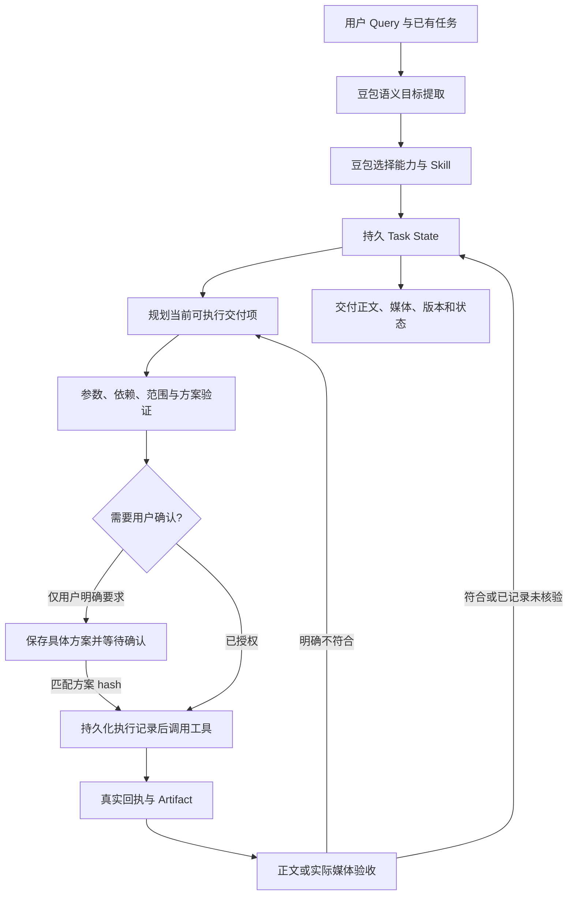

# 单 Agent 任务闭环实现

本次在现有独立项目内替换核心执行循环，保持单 Agent，不增加多 Agent 或外部业务平台依赖。自然语言判断仍由豆包完成，确定性代码负责合同、状态、依赖、数量、来源与提交安全。

## 已实现的闭环



### 1. Goal 与唯一状态

`taskStore` 保存 tasks、artifacts、executions、toolCalls、decisions 与 inputs。Goal 中包含交付媒介、数量、依赖、原始引用、时长/比例/关键文字、缺失信息及安全处置。原始 Goal 保留，调度可以把完全相同操作、规格、引用和约束的独立媒体项合成一个批次，并保留原始目标描述；不通过关键词改写意图。

状态包含 PLANNING、EXECUTING、WAIT_CONFIRM、NEEDS_INPUT、WAITING、PARTIAL、BLOCKED、COMPLETED、FAILED、CANCELLED、REFUSED。每项是否完成由本项实际产物数量及所需观察决定。旧 assets、batches、videoTasks 等字段是状态投影，前端显示同一持久任务快照。

MVP 使用单进程本地 JSON 存储：串行写队列、独立临时文件、fsync、原子替换。没有引入 Postgres、Redis 或向量库；它们是后续多用户部署的替换方向。本版不提供多进程数据库事务保证。

### 2. 规划与工具边界

- 两次豆包调用分别理解用户结果、选择能力，均无执行工具权限。入口格式失败可修正一次，仍失败则不调用媒体。
- 继续或批准任务时，豆包只判断意图与目标 ID，执行器读取已有 Goal 和依赖；批准后按保存的具体参数执行，不重新生成方案。新一轮入口失败不会把上一轮的 Artifact 伪装成本轮成果。
- 当前阶段只开放相关工具。媒体提交必须已有行动计划、满足前序交付、引用来自真实输入或 Artifact、数量未超出目标、没有未知提交、服务已配置。
- 请求看图、读视频、搜索或查任务的文字结论，必须有对应实际工具观察，且引用匹配目标素材。
- 方案检查只验参数和计划，不要求尚未生成的成品。正文检查与实际视觉检查分开。
- 用户明确要求确认时，保存具体参数并计算方案 hash。未确认不生成；参数改变后旧确认失效。普通已授权生成不额外提问。

### 3. 批次、恢复与验证

`propose_*_batch → execute_batch` 一次批次动作执行多项；每次付费提交前写入 pending 执行记录，收到回执即保存。幂等范围是任务、交付项、槽位和参数，避免同一任务重提，同时允许用户明确创建新作品。

进程中断而无回执的提交会转为 unknown，不自动重提。已有异步 ID 由后台每 5 秒查询。批次恢复复用已完成或已提交项。后台验收失败后，可在原任务内继续规划，最多两次后台续跑；媒体提交总预算为目标数量的两倍。超过预算显示部分完成或阻塞。

实际媒体通过豆包多模态输入检查；尺寸、时长和分辨率使用提供方元数据，不从预览猜测。无法观察时记录 unverified，模拟媒体记录 simulated_not_checked，均不能冒充内容检查通过。COMPLETED 表示所需技术交付已齐且没有明确质量失败；不等于所有不确定质量都已解决。

### 4. Skill 合同

15 个本地 Skill 增加角色、适用操作、输入 Schema、输出 Schema、流程、工具边界及验证说明。`read_skill` 返回方法、合同、登记参考资源与脚本；资源只接受清单内完整 path 或稳定资源 ID。

有两条执行路径：`use_skill` 加载方法后由主 Agent 创作并提交正文；`run_skill` 调用豆包生成 `{content, structure}`，通过类型与必填字段校验，保存正文和结构。加载方法不等于运行脚本，也不等于通过结构化合同。run_skill 子调用不开放工具，媒体副作用仍由主执行器控制。12 个登记 Python 脚本沿用参数、输出、哈希和运行预算校验。

### 5. Artifact 与前端

正文与媒体单独保存，绑定 taskId/itemId/sourceExecutionId，支持 parentId 与递增版本。失败版本保留反馈，修订不覆盖原作。最终响应必须带真实正文或媒体地址；只说“已生成”不能使状态完成。

前端增加任务状态、各交付项计数、具体方案确认、继续任务、成果正文、质量状态及“基于此版本修改”。媒体注明 AI 生成。方舟请求关闭可选的画面可见水印，避免与无文字创意要求冲突；没有对已有作品做去水印处理。

## 本次修复中实际发现的问题

| 问题 | 原因 | 处理 |
|---|---|---|
| 十视频只完成部分 | 同类目标被展开后逐个消耗模型轮数；批次只接受当前 count | 合并结构相同的独立目标，保留成员描述，优先批次执行 |
| 确认后不能生成 | 旧提示词仍将未来媒体仅作为 deferred，Agent 只交文字方案 | 清理冲突，要求持久化具体生成方案后进入 WAIT_CONFIRM |
| 方案检查要求实际成片 | 计划、正文、成品共用混杂验收提示词 | 分离三类验收职责 |
| 真实媒体反复因无文字要求失败 | 适配器硬编码开启可选可见水印 | 调整请求参数，界面继续标注 AI 生成 |
| 后台质检失败后空转 | 产物被拒绝但没有继续执行任务 | 返回 PARTIAL，受预算约束的后台续跑 |
| Skill 已输出但无法保存 | method.input.goal 指向自身所属的可变任务项，形成循环引用 | 保存隔离的输入快照，并测试 JSON 可序列化 |

## 验证与复现

完整结果分析见 [本次回归结果](TASK-LOOP-EVALUATION-20260910.md)。原来的 200 条 benchmark 报告保持不变，本次定向闭环回归不能替代完整开放世界评测。

```powershell
npm test
npm run check
# 实际豆包决策 + 模拟媒体，不支付媒体生成费用；run 名称必须未使用
node --env-file-if-exists=.env evals/task-loop-regression.mjs my-run
# 实际生成图片、视频并检查画面，会使用方舟额度
node --env-file-if-exists=.env evals/task-loop-regression.mjs my-real-run --real-media
```

每条回归保留模型输入输出、工具调用、执行回执、目标快照和最终回答。新运行目录带模型、时间和服务器源码 SHA-256。真实 Skill 合同组件验收在 `data/task-loop-skill-contract.json`。

## 当前边界

通用视频二次编辑、字幕、改速不能用重新生成冒充完成；有明确服务的切片、合并、口型等仍取决于扩展配置。当前八项扩展服务未配置，不在本次真实成功范围。素材使用公网 HTTPS 地址，无上传和对象存储服务；签名媒体地址可能过期。质检由同一豆包模型承担，存在共同误判，不能保证所有复杂创意质量。批次槽位的精细角色一致性、跨长片剪辑与成本估算仍需后续评测扩展。

官方接口参考：[图片参数](https://www.volcengine.com/docs/6492/2221472?lang=zh)、[官方 SDK 视频示例](https://github.com/volcengine/volcengine-python-sdk/blob/master/volcenginesdkexamples/volcenginesdkarkruntime/content_generation_tasks.py)。
